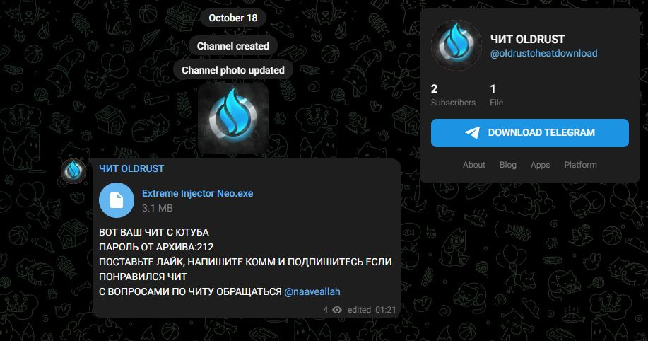

# Троянец DANABOT атакует YouTube: опасность для пользователей читов
DANABOT — это сложный и опасный модульный ботнет и банковский троян.

---

## Первичное заражение

DanaBot активно распространяется через YouTube, например, через публикации чит-программ для игр. Он нацелен на людей за пределами СНГ, что обычно указывает на деятельность группировок с тёмных форумов (таких как Lolz и других).

- Пример публикации на YouTube

На YouTube была найдена публикация, в которой рассказывается о чите, представленном в виде DLL-файла. Он внедряется в процессы игры с помощью Extreme Injector.

Ссылка в комментариях под роликом ведёт на Telegram-канал, где размещён EXE-файл.

- Telegram-канал

Данный файл был загружен на наше устройство, после чего отправлен на AnyRun.

---

## Вредоносный файл

После запуска файла `Extreme Injector Neo.exe` по пути `AppData\\Roaming` создаются файлы `FinalMom.exe` и `ориг инжектор.exe`. Название второго файла указывает на русскоязычное происхождение злоумышленников, что подтверждает теорию о группе, связанной с тёмными форумами.

Файл `FinalMom.exe` выполняет в `cmd` команду, запуская файл `AppData\\Local\\Temp\\f66c2860-ba77-44d2-b687-2a639eb98879.bat`, а также выполняет в PowerShell команду `Add-MpPreference -ExclusionPath 'C:\\'` (добавляет диск C:\\ в исключения Защитника Windows).

Также по пути `AppData\\Roaming\\NursultanCrackClient\\` запускается файл `Runtime Broker.exe`, который крадёт данные из следующих мест:

- `C:\\Users\\admin\\AppData\\Roaming\\FileZilla\\recentservers.xml`
- `C:\\Users\\admin\\AppData\\Local\\Microsoft\\Edge\\User Data\\Network\\Cookies`
- `C:\\Users\\admin\\AppData\\Roaming\\OpenVPN Connect\\profiles`
- `C:\\Users\\admin\\AppData\\Local\\ProtonVPN`
- `C:\\Users\\admin\\AppData\\Roaming\\Telegram Desktop\\tdata`

Файл `Runtime Broker.exe` из `AppData\\Roaming\\NursultanCrackClient` также запускает `cmd`, который выполняет `WScript.exe` для запуска скрипта `AppData\\Local\\Temp\\watchdog.vbs`. Кроме того, мы обнаружили файлы `AppData\\Roaming\\NursultanCrackClient\\ChromiumInjector.exe`, `AppData\\Roaming\\NursultanCrackClient\\Pearl\\Browser Data`, а также процессы `chrome.exe` и `msedge.exe`.

Файл `Runtime Broker.exe` использует Telegram — скорее всего, для получения уведомлений или данных заражённых пользователей.

- Связь с Telegram

Но злоумышленники связываются через `Runtime Broker.exe` не только с Telegram, но и со своим командным сервером.

- Связь с сервером

---

## Заключение

Угроза детектируется антивирусными продуктами как **Trojan-Dropper.MSIL.Dapato**.

---

## Источники

- `hxxps://www.youtube.xxx/`
- `hxxps://t.me/oldrustcheatdownload`
- `https://app.any.run/tasks/2290d52c-40ae-4b32-a3d6-77c5b9dc6b51`

---

